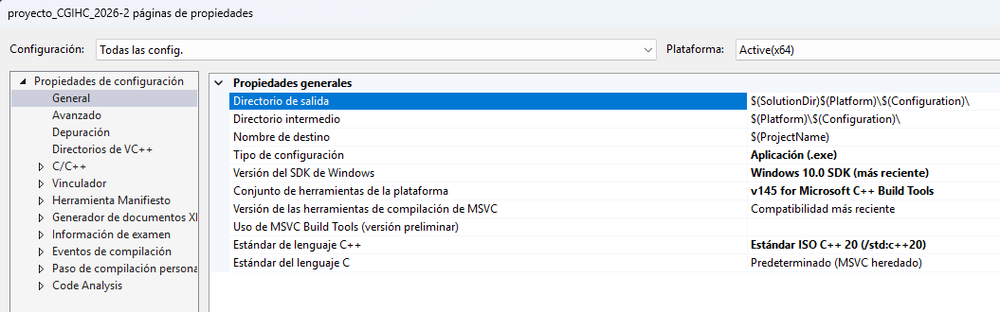

# Proyecto Final - Computación Gráfica e Interacción Humano-Computadora

**Semestre:** 2026-2  
**Facultad de Ingeniería, UNAM**

---

## Descripción del Proyecto

Este proyecto consiste en la simulación de un entorno 3D interactivo, representando especificamente el sotano de la Facultad de Ingeniería, UNAM. Especifcamente se representa el espacio que se encuentra a la entrada del auditorio "Javier Barros Sierra". Fue desarrollado con **OpenGL** y **C++**. La escena incluye:

- Modelos estáticos y animados.
- Cámara en primera persona controlada por teclado y ratón.
- Sistema de animación utilizando maquinas de estados. 
- Audio ambiental en bucle (OpenAL).
- Texturas aplicadas a objetos primitivos y modelos importados.

---

## Integrantes del Equipo
- Chávez Madrid Ismael Ángel 
- Hernández Jiménez Efrén Antonio
- García Cárdenas Fabián
- Padilla Cázares Jesús Alejandro  

---

## Herramientas y Configuración

### Kit de herramientas de Visual Studio utilizado

<!-- Agrega aquí la captura de pantalla del instalador de Visual Studio mostrando los componentes instalados -->

**Entorno de desarrollo:**
- **IDE:** Visual Studio 2026
- **Kit de herramientas:** Desarrollo para escritorio con C++

### Librerías y dependencias

| Librería | Propósito |
|----------|-----------|
| **GLFW 3.x** | Creación de ventana, contexto OpenGL y manejo de entrada |
| **GLAD** | Carga de funciones de OpenGL |
| **GLM** | Matemáticas para gráficos (vectores, matrices) |
| **Assimp** | Importación de modelos 3D (.obj, .dae) |
| **stb_image** | Carga de imágenes para texturas |
| **SDL 3** | Temporización y control de FPS |
| **OpenAL Soft** | Reproducción de audio ambiental |
| **AudioFile** | Carga de archivos de audio .wav |

---

## Controles

| Tecla | Acción |
|-------|--------|
| **W / A / S / D** | Movimiento de cámara (adelante, izquierda, atrás, derecha) |
| **Ratón** | Orientación de la cámara |
| **Scroll** | Zoom in / out |
| **ESC** | Salir de la aplicación |

---

## Características Implementadas

### Sistema de Animación

- **Máquina de estados:** Controla el comportamiento de múltiples personajes (caminar, esperar, hablar).
- **Movimiento circular paramétrico:** Un personaje sigue un arco definido por ecuaciones trigonométricas.

### Audio

- Sonido ambiental reproducido en bucle con OpenAL.

### Modelos

- **Estáticos:** Bancas, columnas, rejas, muros, ventanas, lámparas, stands, escaleras, robot Zaku.
- **Animados:** 11 personajes con comportamientos autónomos (hablar, caminar, señalar).

---

##  Instrucciones para Compilar y Ejecutar

1. **Clonar el repositorio** (o abrir la solución en Visual Studio).
2. **Configurar las dependencias:**
   - Incluir directorios de: GLFW, GLAD, GLM, Assimp, SDL3, OpenAL, AudioFile.
   - Enlazar las librerías `.lib` correspondientes.
   - Colocar los `.dll` necesarios en el directorio de salida.
3. **Verificar rutas de recursos:**
   - Asegurarse de que las carpetas `resources/`, `shaders/` y `Texturas/` estén en el directorio de trabajo.
4. **Compilar en modo Debug x64**.
5. **Ejecutar.**

> *Nota: Para la carga de audio, es necesario tener OpenAL Soft instalado en el sistema.*

---

## Notas Adicionales

- El archivo `AudioFile.h` es una librería de cabecera única para cargar archivos `.wav`.
- Los modelos animados usan el formato **Collada (.dae)** y son procesados por Assimp.
- El código incluye secciones comentadas que sirven como referencia para dibujar primitivas con textura.

---

## Licencia

Este proyecto fue desarrollado con fines educativos para la asignatura de **Computación Gráfica e Interacción Humano-Computadora** de la Facultad de Ingeniería, UNAM.